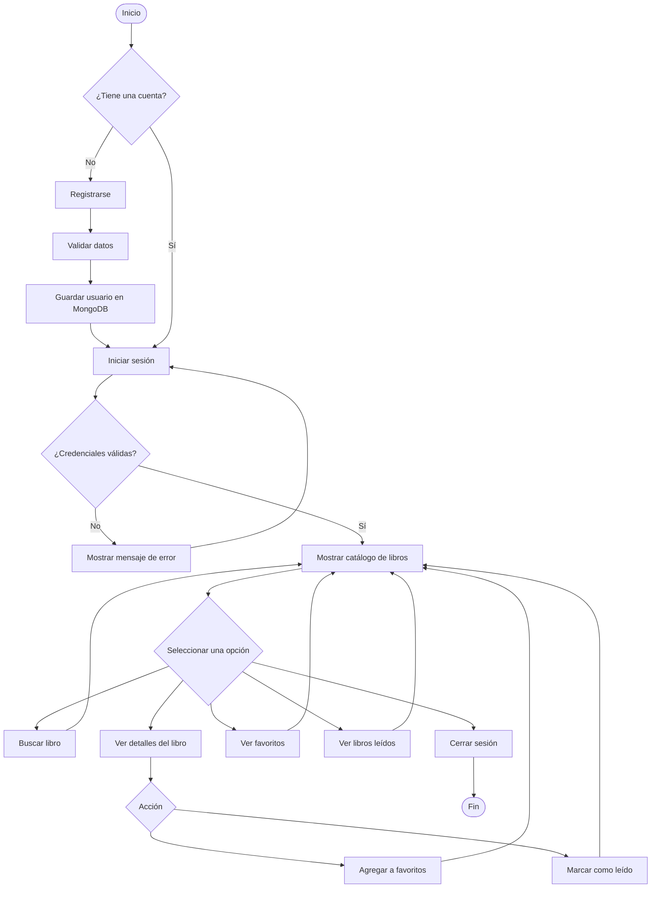

```mermaid
flowchart TD

A([Inicio]) --> B{¿Tiene una cuenta?}

B -- No --> C[Registrarse]
C --> D[Validar datos]
D --> E[Guardar usuario en MongoDB]
E --> F[Iniciar sesión]

B -- Sí --> F[Iniciar sesión]

F --> G{¿Credenciales válidas?}

G -- No --> H[Mostrar mensaje de error]
H --> F

G -- Sí --> I[Mostrar catálogo de libros]

I --> J{Seleccionar una opción}

J --> K[Buscar libro]
K --> I

J --> L[Ver detalles del libro]
L --> M{Acción}

M --> N[Agregar a favoritos]
N --> I

M --> O[Marcar como leído]
O --> I

J --> P[Ver favoritos]
P --> I

J --> Q[Ver libros leídos]
Q --> I

J --> R[Cerrar sesión]
R --> S([Fin])
```
